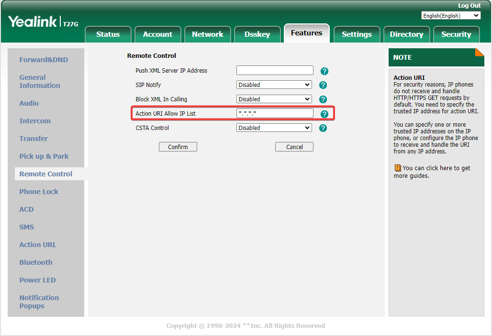
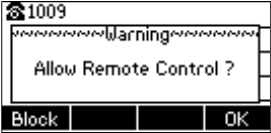

# Yealink Manager API

Usage of the Yealink Manager API.

## Getting Started

```python
    import time
    # Program parameters
    username = 'admin'
    password = 'admin'
    phone_ip = '192.168.1.10'
    try:
        yl = YealinkController(username, password, phone_ip)
        yl.set_line(1)
        yl.get_status()
        yl.dial('1234')
        yl.screenshot()
        time.sleep(5)
        yl.hangup()
        yl.screenshot()
    except Exception as e:
        print(e)
```

**Set action URI allowed**
</br>


**On device accept control**
</br>


## API Documentation

TODO: DOCS

## Alternatives

- [yealink-dialler](https://github.com/calebplum/yealink-dialler.git)
- [yealink-remote-manager](https://github.com/jonbulica99/yealink-remote-manager.git)

## Other Information

- [Variable Values List - Yealink SIP-T2 Series Administrator's Manual](https://www.manualslib.com/manual/1883377/Yealink-Sip-T2-Series.html?page=462#manual)
- [Yealink SIP-T2 Series Administrator's Manual](https://www.manualslib.com/manual/1260800/Yealink-Sip-T2-Series.html?page=756#manual)
